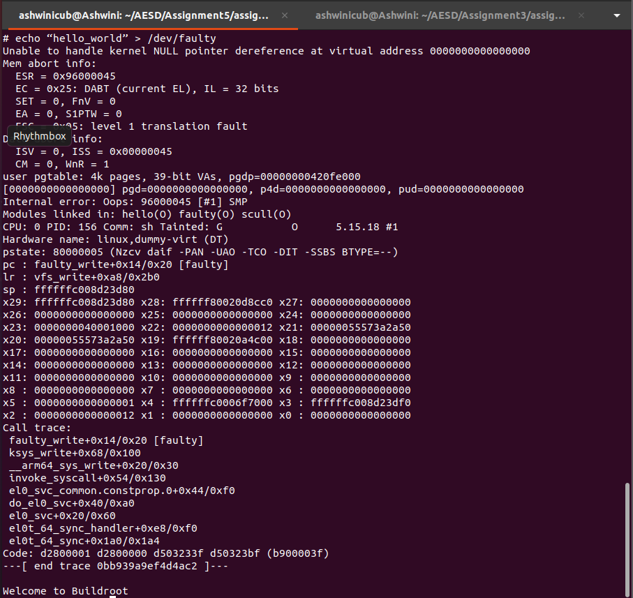

# Analysis of Faulty OOPS

## Command used 
    $ echo “hello_world” > /dev/faulty

## Output
 

# echo “hello_world” > /dev/faulty
Unable to handle kernel NULL pointer dereference at virtual address 0000000000000000

Mem abort info:
  ESR = 0x96000045
  EC = 0x25: DABT (current EL), IL = 32 bits
  SET = 0, FnV = 0
  EA = 0, S1PTW = 0
  FSC = 0x05: level 1 translation fault

Data abort info:
  ISV = 0, ISS = 0x00000045
  CM = 0, WnR = 1

user pgtable: 4k pages, 39-bit VAs, pgdp=00000000420fe000
[0000000000000000] pgd=0000000000000000, p4d=0000000000000000, pud=0000000000000000
Internal error: Oops: 96000045 [#1] SMP
Modules linked in: hello(O) faulty(O) scull(O)
CPU: 0 PID: 156 Comm: sh Tainted: G           O      5.15.18 #1
Hardware name: linux,dummy-virt (DT)
pstate: 80000005 (Nzcv daif -PAN -UAO -TCO -DIT -SSBS BTYPE=--)
pc : faulty_write+0x14/0x20 [faulty]
lr : vfs_write+0xa8/0x2b0
sp : ffffffc008d23d80
x29: ffffffc008d23d80 x28: ffffff80020d8cc0 x27: 0000000000000000
x26: 0000000000000000 x25: 0000000000000000 x24: 0000000000000000
x23: 0000000040001000 x22: 0000000000000012 x21: 00000055573a2a50
x20: 00000055573a2a50 x19: ffffff80020a4c00 x18: 0000000000000000
x17: 0000000000000000 x16: 0000000000000000 x15: 0000000000000000
x14: 0000000000000000 x13: 0000000000000000 x12: 0000000000000000
x11: 0000000000000000 x10: 0000000000000000 x9 : 0000000000000000
x8 : 0000000000000000 x7 : 0000000000000000 x6 : 0000000000000000
x5 : 0000000000000001 x4 : ffffffc0006f7000 x3 : ffffffc008d23df0
x2 : 0000000000000012 x1 : 0000000000000000 x0 : 0000000000000000

Call trace:
 faulty_write+0x14/0x20 [faulty]
 ksys_write+0x68/0x100
 __arm64_sys_write+0x20/0x30
 invoke_syscall+0x54/0x130
 el0_svc_common.constprop.0+0x44/0xf0
 do_el0_svc+0x40/0xa0
 el0_svc+0x20/0x60
 el0t_64_sync_handler+0xe8/0xf0
 el0t_64_sync+0x1a0/0x1a4
Code: d2800001 d2800000 d503233f d50323bf (b900003f) 
---[ end trace 0bb939a9ef4d4ac2 ]---

## Analysis

1. Kernel OOPS: The message shows that null point dereference while executing the command. The kernel tried to access memory at the virtual address 0x00 and couldn't handle this invalid memory access.
2. Mem Abort Info: The section provides additional information about the memory access fault in which ESR (Exception Syndrome Register) is set to 0x96000045 and EC (Exception Class) is 0x25, indicating a Data Abort (DABT) in the current Execution Level (EL).
3. Function Call Stack: The log includes a call stack, which shows the sequence of function calls leading up to the error. faulty_write is the function from the "faulty" kernel module that was being executed when the error occurred. The program counter (pc) was at an offset of 0x14 within this function. vfs_write is another function (from the Virtual File System) that was called by the faulty_write function. The call stack indicates that the error occurred within the faulty_write function.
4. Before Call trace, it gives information about the link register, stack pointer and other general purpose registers. At the end, call trace gives the function calls.
5. In summary, the log captures a kernel Oops that happened when the echo command attempted to write to the /dev/faulty device, which is associated with the "faulty" kernel module.

## Reference
https://wiki.ubuntu.com/DebuggingKernelOops

Referred ChatGPT to understand the logs
